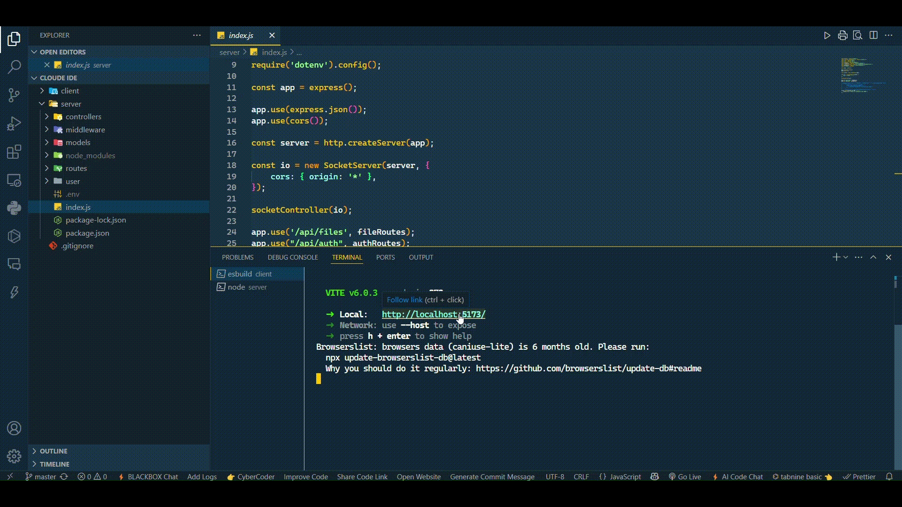

# An Online IDE: An isolated developer tool to build or code anything 

A cloud-based, isolated development environment that allows developers to write, run, and debug code from anywhere. It supports multiple languages and tools, making it easy to build, test, and deploy projects without local setup.

## Demo

## Documentation
### Current System Design 
[View on Eraser](https://app.eraser.io/workspace/Kngf96PZk0NN7YyAoyMW?elements=3LkXoFpzixpQObRoEMbz9g)

### Optimised System Design

If we design the architecture to include a bridge to an EC2 instance and integrate it with an object storage service (such as AWS S3 or Cloudflare R2), we can manage user state efficiently. For user authentication, we can implement a mechanism where a new user triggers the launch of a fresh container instance, with the object store maintaining the user’s current state. When a returning (authenticated) user connects, the system can reference the previously stored container ID and retrieve the corresponding file and state information from the object store, ensuring a seamless and consistent user experience.